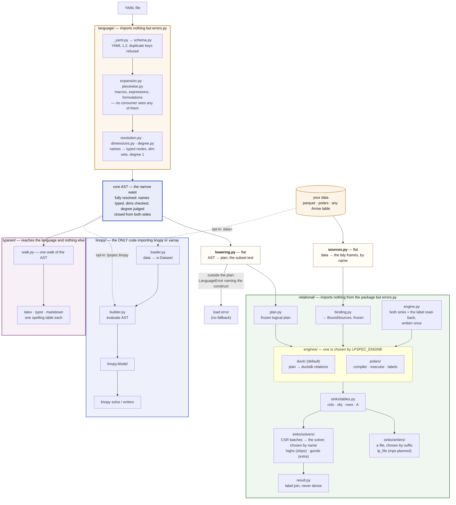
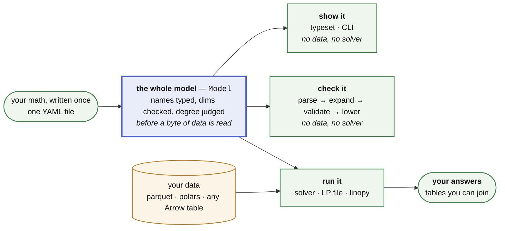

# Architecture

Brief, current, precise. A PR that changes the structure described here updates
this file in the same PR. The language is [docs/SPEC.md](SPEC.md); what may
enter it is [docs/design/ceiling.md](design/ceiling.md); plans and refusals
are [docs/ROADMAP.md](ROADMAP.md); measured results are
[docs/benchmarks.md](benchmarks.md), produced by the harness in
[bench/](https://github.com/fluxopt/lpspec/blob/main/bench/README.md) — which is
also how a claim here gets falsified.

`python examples/walkthrough.py` executes the pipeline below stage by stage
and prints what each one produces — the same public calls `lps.solve` makes,
so the demonstration cannot drift from the code. Its output is committed as
[examples/walkthrough.out](https://github.com/fluxopt/lpspec/blob/main/examples/walkthrough.out) and asserted line for line
(`tests/test_walkthrough.py`), so reading it is the same as running it — and a
stage that starts telling a different story shows up as a diff in that file.

## Thesis

A YAML math spec is a **closed AST known before any data is touched**. That one
property makes everything else legal: the whole model can be compiled — to eager
xarray/linopy calls, or to a logical plan executed relationally and streamed to a
sink — with both paths provably meaning the same thing. Every rule below protects
it. (A *declared* memory ceiling is not something we have; see
[the memory axis](ROADMAP.md#where-it-is-going).)

**Four directories, four fences.** One produces the AST; three consume it and
know nothing of each other. Each box below is a directory, and its subtitle is
the import rule `tests/test_architecture.py` enforces off the path — so a
module cannot step over a fence by being spelled differently.

**The two dashed boxes are outside every fence, and that is the point.**
`lowering.py` and `sources.py` are the seam: one turns the AST into a plan, the
other turns a caller's tables into the frames a plan is executed against, and
neither belongs to the side it hands to. Drawing them inside `relational/`
would be a lie about the fence — the engine imports nothing from the package,
while both of these read the schema.

**Data enters below the seam, and each lane coerces its own** — `sources.py` for
a native build, `linopy/loader.py` for the shim, separate on purpose since one
produces tidy polars frames and the other an `xr.Dataset`. Their one shared
piece is the `convex:` curvature guard, which needs values rather than a schema
and so lives with the data. What matters for the waist is the direction: data
goes no further **up** than these two, so nothing above the seam has ever seen a
value — which is what makes `show it` and `check it` free.

Only six modules sit outside a fence, and each is legitimately **both** halves:
the two drawn above, plus `api.py`, which runs the lot, `errors.py`, the leaf
every fence points at, and `__main__.py` / `_notes.py`, which are plumbing.
That is a category, not a leftovers bin — see
[What counts as language](#what-counts-as-language).

Eligibility is decided by **attempting the lowering** — `lower_program` returns
a `Program` or raises `lps.LanguageError` — so it cannot drift from what the
engine supports. Errors split model from run: everything under `LanguageError`
is decidable without data, `DataError` is what a source failed to supply, and
both are `LpspecError` (`errors.py`). Expansion precedes validation in **both** lanes,
because a formulation emits declarations and those are language too — a stray
dim in generated math is the same error as a stray dim in a written one.

## One contract, many consumers

The AST is a **narrow waist**. Everything upstream emits it, everything
downstream reads it, and nothing else has to agree on anything — so the model
you write once is the same model that gets checked, solved, typeset and read
back.

**Only one arrow carries data, and it arrives after the model is already
judged.** That is the contract the waist is: `Model` is complete —
names typed, dims checked, degree decided — before a source is bound, so
`show it` and `check it` are not cut-down versions of a build, they are the
same model with the data arrow missing. `check` is the build's own front half
run to completion and stopped before binding, which is why it is a CI verb,
costs seconds, and needs nothing but the file.

**Each box is a family, and [the table below](#the-python-surface) is its
members** — including the ones nobody has built, which is the point: none of
them is a rewrite. Each reads the same AST the engine reads, so a renderer is a
tree walk, a check is a pass with no data bound, and a new output format is one
module in `relational/sinks/writers/`.

`typeset/` is that claim cashed — a **spike** that typesets any model the lanes
can build, in one walk of the resolved AST, holding no opinion the lanes do not
already hold: a `piecewise:` block prints as the λ-formulation it expands to,
not as the sugar it was written as. How names *print* is the one thing it does
not read off the model, since a symbol table is presentation — hence a sidecar
file (`examples/symbols/`) rather than keys on `Model`, and a model with no
table still renders. It splits the way `relational/sinks/writers/` does, one
module per output format, so a format is a spelling table rather than a second
walk that could disagree. `python -m lpspec <format>` is its shell front, one verb per
entry in `typeset.FORMATS`: a consumer that needs no data needs no runner.

**That front is typeset's, not the package's**, and it is not the start of a
command line. It exists because rendering a model belongs in a Makefile beside
`pdflatex`; the rule that keeps it from growing is that **no verb may become a
second way to spell the source mapping** — `--source name=path` is `lps.solve`'s
dict with worse errors, and `solve_over`'s axis and `carry` cannot be said in
flags at all. A shell-driven *solve* would therefore have to arrive as one path
argument over a run manifest, never as flags.

That claim is enforced twice, because a renderer that imports only `language/`
still pays for polars if some language module does: a path-scoped import rule
like the other three fences, plus a check on the **transitive** closure. Two
properties carry the rest — **data enters at exactly one place**, which is why
checking a model costs seconds and needs nothing but the file, and the waist is
**closed**, which is what the ceiling in
[docs/design/ceiling.md](design/ceiling.md) protects: a new consumer is free, a
new primitive is taxed. What is planned, and why, is
[docs/ROADMAP.md](ROADMAP.md).

### The Python surface

**Nineteen names, and the count is the feature.** The model is the YAML file; Python
is how you *run* it — so the whole surface is the diagram above written out,
with nothing that constructs math and nothing that reaches the plan. Names are
`lpspec.` unless shown otherwise, and what each one *does* is
[docs/api.md](api.md). **Data?** is the column that matters: a verb
that says *no* needs nothing but the file, which is what makes it a CI verb.
*Italic rows are the ones the shape makes cheap and nobody has built.*

| | you want to | the call | data? |
|---|---|---|---|
| **load it** | parse and validate, and stop there | `load_model` → `Model` | no |
| **show it** | typeset for a paper or a review | `to_latex` · `to_typst` · `to_markdown` (spelling: `SymbolTable`) | no |
| | render one from a Makefile | `python -m lpspec <format>` — the only shell front, and typeset-only | no |
| | *watch what a build is doing* | | |
| **check it** | will this build, is the math sayable, do the dims line up | `check` — parse → expand → validate → lower, one pass, every answer | no |
| | *will that solver take it, and how big is it* | | |
| **run it** | stream it straight into a solver | `solve`, or `build` to drive several sinks off one build | **yes** |
| | write an LP file for anything else | `write` | **yes** |
| | solve it once per scenario, window or period | `solve_over` over a `EachCoordinate` / `EachWindow` axis | **yes** |
| | put the same math on a `linopy.Model` | `lpspec.linopy.build` · `.extend` (`data=`, its own coercion) | **yes** |
| **read it** | values, shadow prices, the objective | `result.objective` · `.primal` · `.dual`, plus the status pair | — |
| | bridge out to another library | `.to_pandas` · `.to_dataarray` · `.to_parquet` | — |
| | *derived results; re-solve with new numbers, same labels* | | |
| **catch it** | tell a bad model from bad data | `LpspecError` ⊃ `LanguageError` · `DataError` · `DimensionError` · `SchemaError` · `PiecewiseExpansionError` | — |

**Flat, and a namespace marks a lane rather than a topic.** `lpspec.linopy` is
the only one, and it earns it by being a different lane — its own dependencies,
its own oracle, its own two-verb surface with its own test. `strategy.py` is not
a lane, so `solve_over` and its axes sit at the top level beside `solve`.

That is a rule with teeth rather than a taste: the surface test exempts
submodules (`not inspect.ismodule`), so moving names under `lpspec.something`
moves them out from under the list a reviewer reads. **Grouping trades an
enforced surface for a tidier one**, which is the opposite of what the count is
for.

**A return type is not a name.** `solve` returns a `Result` and `solve_over` a
`Runs`, and neither is exported — you reach them by calling, and import them
from their module only to write an annotation. What the objects themselves
carry (`Result` alone has twelve readers) is documented in
[docs/api.md](api.md) rather than counted here, which is why capability grows
much faster than this table does.

**What the data arrow carries** is [SPEC §8](SPEC.md#8-data-binding) and is not
restated here. The one structural fact: **binding is by name at both levels** —
a mapping keyed by declared parameter, and inside each table, columns named for
that parameter's declared dims. The single positional fallback (an *unnamed*
pandas index) is narrow on purpose, because renaming a named level would
transpose the data silently whenever two dims share a label space.

`tests/test_architecture.py` pins all of it: `__all__` must match the table,
**and** no public non-module attribute may exist outside it. Both directions,
because either alone rots — the first catches a name documented and never
exported, the second a helper that leaked into the namespace by being imported
at the top of `__init__.py`. That check found one the day it was written.

There is deliberately no Python API for *constructing* a model, no way to hand
in a plan, and no registry to populate. That is hard rule 5 below, and it is
what makes a `.yaml` file the thing you review, diff and cite — rather than the
serialisation of a Python object you would have to run to understand.

## Hard rules

*Enforced, not aspirational: `tests/test_architecture.py` encodes these as
static checks and CI's bare-install job proves the dependency claims.*

**These rules constrain the language.** What a construct may say, which layer
may know what, and what a file means on its own — each survives any engine, and
each decides what can enter `docs/SPEC.md`. How much a build *costs* is a
property of the engine, measured in [docs/benchmarks.md](benchmarks.md), and
deliberately not a rule: a cost phrased as a rule makes one implementation's
choice load-bearing in the language's rulebook.

0. **The layers are ordered, and imports prove it.** Every module imports only
   downward, at module level, with **no exception at all**:
   `DELIBERATE_LAZY_IMPORTS` in `tests/test_architecture.py` is empty, and an
   undeclared in-function import fails the build. A lazy import here is only
   ever a leftover — a cycle to remove, not to defer.
1. **Core AST is the whole language.** Both backends consume only core AST —
   macros, named expressions and `piecewise:` are expanded away before dispatch,
   and the plan/query/xarray are backend-private. The AST crossing that seam is
   **fully resolved**, names typed `Variable`/`Parameter`/`Dimension`, so a
   backend cannot hold its own opinion about what a name refers to. The waist is
   closed from the front too: nothing under `language/` imports `lowering`,
   `sources`, `api` or any consuming subpackage (`LANGUAGE_MAY_IMPORT`), so what
   a model *means* cannot depend on what is done with it. `load_model` sits
   inside that fence — parsing and validating is the language's own job, and a
   consumer that binds no data must reach it without reaching a runner; `api.py`
   re-exports it so callers keep saying `lps.load_model`.
2. **The engine knows nothing about linopy, xarray or YAML.** `relational/` goes
   plan → engine → a solver sink → solver, with linopy's semantics as a spec to match
   rather than code to share; it never sees the schema, the AST, or the eager
   builder. **An engine is a directory, not a convention:** `engines/polars/`
   and `engines/duck/` are implementations, and everything above them —
   `plan.py`, `engine.py`, `sinks/`, `binding.py`, `status.py`, `chunking.py`,
   `frames.py` — is what an implementation answers to. An engine package is
   named for its engine; nothing *inside* one is.
   Enforced *more* strictly than stated — it imports nothing from the
   package at all, bar declared dependency-free leaves (`errors.py`, in
   `ENGINE_MAY_IMPORT`), because a near-zero import surface is what keeps the
   subpackage extractable. Widening that list is a decision, not an accident.
3. **One language, two lanes — not fast-vs-slow versions of each other.** A
   *lane* consumes the AST and owns everything below it; an *engine* consumes
   the plan and fills `ModelTables`. They are different axes and the words are
   not interchangeable: the relational lane has two engines (`duckdb`, the
   default, and `polars`), both installed and neither behind an extra — and
   linopy is a lane and could not be an engine, because it never sees
   the plan, produces no `ModelTables`, and `extend` attaches to a model that
   already exists. The
   streaming engine builds models declared in YAML; the linopy lane attaches YAML
   math to a `linopy.Model` already in memory. **Both accept exactly the same
   language**, and no helper registry exists that could create a divergence —
   that equality is what makes the differential tests an oracle rather than a
   comparison of dialects. A construct outside the language is a load error
   naming the construct and its rewrite, never a redirection to the other lane.
4. **Backend-visible YAML files are self-contained.** No Python-side state
   (registries, session objects) may change what a file means.
5. **The public interface is a declared model, not a Python API.** YAML is what
   we ship and document; the contract underneath is `Model`, and whether
   that seam is ever blessed is open
   ([#381](https://github.com/fluxopt/lpspec/issues/381)). The Python surface is
   the runner (`api.py`) and the driver over it (`strategy.py`); the plan is
   internal. The whole of it is
   [nineteen names](#the-python-surface), pinned by a test — so the surface grows
   through a list a reviewer reads, like every other fence here.

## The relational lane

**The spine is one module per box above.** `binding.py` takes the tidy frames
`sources.py` handed over the seam and freezes them into what every query is
written against; `compiler.py` turns plan nodes into
lazy frames and reads nothing; `executor.py` fills the model frames; `sinks/`
drains them. Two more sit beside the executor rather than inside it, because
each answers a question the executor merely *uses*: `labels.py` decides which
coordinate gets which solver index, and `result.py` is what a caller reads a
solve back through. The remaining five are not on the spine and the diagram
does not draw them — `plan.py` is the vocabulary the spine speaks, `frames.py`
and `status.py` are the two boundaries (a caller's table in, a solver's
verdict out), and `chunking.py` and `data_validation.py` are single rules
lifted out of whoever needed them first. The map below is the full list.

That split is what makes the ceiling's admissibility test something you can
*perform* rather than reason about: build a `PolarsCompiler`, hand it a node,
read `.explain()` — `tests/test_compiler.py` does exactly that over empty
frames, since a schema is all it takes to compile a query. It is also why a new
sink is a module in one of two families rather than another method on the
executor.

**What binding produces is a value.** `BoundSources` is frozen — parameters,
dimensions, their cardinalities, and which parameters are boolean — because a
query is written against data that has stopped changing. The variable frames
are passed *beside* it and stay mutable, since a variable frame appears as its
declaration is built and a constraint compiled afterwards has to see it. That
is the one live registry in the lane, and keeping it out of the carrier is
what makes it visible in a signature rather than only in a docstring.

**Tidy tables.** Parameters are `(dims…, value)`; a variable frame is
`(dims…, var_label)`, one row per *existing* variable; a linear expression is
`(frame dims…, var_label, coeff)` plus a constant part; constraint rows are
`(row, sense, rhs)`; the coefficient matrix is COO `(row, col, coeff)` while
declarations build, and lands as CSR at assembly — `(col, coeff)` in row-major
order plus a `row_starts` offset array, the same three arrays a solver takes,
at 12 bytes per entry. Masks
are **row absence** — no NaN sentinels, no `-1` labels. Broadcasting is a join,
`sum` drops coordinate columns, `sum(group_by=)` joins the dim table and projects a
declared coordinate in place of the grouped dim. Neither aggregates: both
rewrite a fragment's dim tuple, and duplicates collapse in the terminal
`SUM(coeff) GROUP BY row, col` at assembly.

**The label contract**, and the one place order is load-bearing. Everything else
in the lane is order-free, which is what lets the query planner rearrange it.

- Labels are dense `0..n-1` by construction, so `var_label` **is** the solver
  column index and `row` the solver row index — no remapping. That is why
  value-only re-solve is cheap, why appending rows is safe, and why structural
  editing is out of scope.
- They are **row-major over the masked coordinate product**, sorted on the
  dimensions' declared ordinals. A contract, not a side effect: it is what makes
  a build reproducible run to run.
- Variables and constraint rows are the same operation over different frames and
  it is written once (`labels.frame`): number the surviving coordinates by their
  row-major position in the declared product. A mask that cannot see the leading
  dims leaves the survivors a *rectangle*, so only the masked suffix is
  materialised — a guarded shortcut inside that one function, which must reach
  the integers the general path would have. That is why labelling is a module
  with stated inputs rather than a method among twenty: nothing else about a
  build can move an index. **Which** route a mask allows is a property of the
  plan rather than of an engine, so both engines ask `plan.free_prefix` and
  only the executions are written twice.
- The same order comes **back**: `primal` / `dual` / `to_parquet` read the
  label frame, which was numbered in that order, and the LP sink writes it.

**The plan is affine-by-design.** No node introduces variables or constraints as
a side effect of an expression; formulations are model *transformations*.
Variable *types* are not formulations — binary/integer are a `vtype` column, LP
`binary`/`general` sections and HiGHS integrality, which keeps basic MILP inside
the streaming lane. Reimplementing linopy's reformulation passes inside the plan
is explicitly rejected: that duplicates the library this package consumes.

**A frame is the boundary in both directions.** `relational/frames.py`
recognises a caller's table through the Arrow PyCapsule protocol without
importing any dataframe library, and `Result.primal` hands back a
`polars.DataFrame`, which exports the same protocol. That symmetry is what
keeps pandas and pyarrow off the dependency list: they are bridges *out*
(`to_pandas`, `to_dataarray`), shipped with the `[linopy]` extra, not shapes
the engine holds. The bare-install CI job runs the suite with neither present.

**Sinks are capped, explicitly.** Today every sink expresses the same three
streams and no more: `cols` (bounds, objective coefficients, integrality),
`rows`, and `A` in CSR. The upgrade path is two further streams — `sos_sets`
and `genconstr` — plus a semi-continuous threshold on `cols`. Unlike the three
that exist, those two would land *unevenly*, because the destinations differ
per sink (see "Capability is not the ceiling"); that unevenness is what
[Track 3](https://github.com/fluxopt/lpspec/issues/472) exists to make declared rather
than discovered at solve time.

**A sink is one of two things, and the directory says which.** A **solver**
runs the tables and returns an answer, chosen by **name** at the call
(`solver_name='gurobi'`); a **writer** renders them to a file, chosen by the
output's **suffix** — because a file's format is a property of the file, while
which solver runs is a property of nothing but the call. Both sets are closed
dict literals (`SOLVERS`, `WRITERS`): no YAML key names a solver, and nothing
installed may change what either resolves to.

The split is a directory rather than a convention for the reason `engines/` is:
**how many solvers there are will change, and what a solver has to answer will
not.** A new one is a module named for it and a line in `SOLVERS` — no method
on the executor, no branch in `api.py`, no name on the Python surface. Members
share the projection of `cols` and `obj` onto the solver's column index, which
lives on `ModelTables` so two solvers cannot drift into loading different
models; they never share hand-off code, because the currencies differ (HiGHS
takes the three CSR arrays, gurobipy a matrix object) and because `gurobipy`
must stay off the import path of a caller who does not use it.

## Module map

| Module | Role |
|---|---|
| `language/_yaml.py` | the only place a file is read: YAML 1.2 booleans, duplicate keys refused |
| `language/model.py` | pydantic schema incl. `expressions:` / `macros:` / `piecewise:` |
| `language/expression_parser.py`, `language/where_parser.py` | text → core AST; grammar only, dependency-free |
| `language/expansion.py` | named-expression / macro substitution (pre-dispatch) |
| `language/resolution.py` | one flat namespace; `NameNode` → typed `Variable`/`Parameter`/`Dimension` nodes |
| `language/dimensions.py` | static dim-set checking over the resolved AST |
| `language/degree.py` | degree 1: the ceiling's first clause, asked by both lanes and stated by neither |
| `language/helpers.py` | the closed set of built-in operators: their *names* and *call shapes* — no registry |
| `language/validation.py` | load-time: parse, expand, resolve, check everything — and `load_model`, the language's front door |
| `language/piecewise.py` | `piecewise:` → λ-formulation declarations |
| `api.py` | the runner: `check` / `build` / `solve` / `write`, linopy-free; re-exports `load_model` |
| `typeset/` | **spike** — resolved AST → LaTeX / Typst / Markdown. A reader, not a lane: no model, no data, no plan ([README](https://github.com/fluxopt/lpspec/blob/main/src/lpspec/typeset/README.md)) |
| `__main__.py` | `python -m lpspec <format>` — the typeset shell front, and the only one there is |
| `sources.py` | bind runtime data (parquet paths / in-memory tables) to a validated schema; the `convex:` curvature guard, which is the one check that needs values |
| `lowering.py` | core AST → logical plan (defines the relational subset) |
| `errors.py` | the exception hierarchy; the one module either fenced side may import |
| `_notes.py` | attach context to an exception on the way out; no package imports, no opinions |
| `strategy.py` | the driver above the runner: one plan per slice, folded — scenarios, rolling horizon, myopic pathways |
| `relational/plan.py` | frozen logical-plan dataclasses — what an engine consumes |
| `relational/engine.py` | the engine base: what one must supply, and the sinks and label joins it gets for free |
| `relational/engines/__init__.py` | name → engine, a closed set; `LPSPEC_ENGINE` resolves through it, and unset means `duckdb` |
| `relational/binding.py` | a caller's sources → `BoundSources`, the frozen frames every engine is written against |
| `relational/data_validation.py` | is the bound data usable — one row per coordinate, labels that exist, single-valued coords |
| `relational/engines/duck/compiler.py` | plan → duckdb relations; the duckdb twin of the polars compiler |
| `relational/engines/duck/executor.py` | assemble the model frames through duckdb |
| `relational/frames.py` | the boundary — caller tables in, via the Arrow PyCapsule protocol |
| `relational/engines/polars/compiler.py` | plan → lazy frames; pure, reads nothing |
| `relational/chunking.py` | how a batched pass sizes its chunk: budget ÷ the width of one unit |
| `relational/status.py` | solve outcome on two axes; linopy's vocabulary, copied not imported |
| `relational/engines/polars/labels.py` | which coordinate gets which solver index; one rule, one guarded shortcut that must agree with it |
| `relational/engines/polars/executor.py` | assemble the model frames from the bound data |
| `relational/result.py` | what a solve returned: status, objective, and the label joins that read values back |
| `relational/sinks/tables.py` | what every sink reads and no more — the four frames, their dtypes and the batching scalars, and their projection onto the solver's column index; what an engine produces |
| `relational/sinks/` | how a built model leaves, in two families: `solvers/` (one module per solver, chosen by name) and `writers/` (one per format, chosen by suffix) — [README](https://github.com/fluxopt/lpspec/blob/main/src/lpspec/relational/sinks/README.md) |
| `linopy/__init__.py` | opt-in shim: `build` / `extend` on a `linopy.Model` |
| `linopy/loader.py` | data coercion to `xr.Dataset`, master coords |
| `linopy/builder.py` | eager backend: core AST → `linopy.Model` |
| `linopy/semantics.py` | where this lane answers linopy's v1 arithmetic convention — one home, as linopy's own `semantics.py` is |

**Four subpackages, and the directory *is* the rule in every case.** Everything
under `language/` produces the AST and may not reach a consumer of it;
everything under `relational/` is the relational lane and imports nothing else
from the package, with a second boundary inside it — `engines/` holds the two
implementations, the rest of `relational/` is what they implement, and which
one runs is `LPSPEC_ENGINE` rather than anything a model can say; everything
under `linopy/` is the opt-in eager lane and is the only code allowed to import
linopy or xarray; everything under `typeset/` reads the
AST and writes text, and reaches neither the plan nor any data.
`tests/test_architecture.py` reads membership off the path in all four cases,
so no fence can be stepped over by naming a file differently.

`language/` and `relational/` are the two halves of the waist and their fences
point the same way — outward, at `errors.py`, the one leaf both may import.
`typeset/`'s points there too, which is what makes "a new consumer is free" a
measurable claim rather than a hope: it is enforced twice, once on the names a
renderer imports and once on the transitive closure behind them, because a
consumer's real cost is what it drags in, not what it spells.

### What counts as language

A fence says what may not happen; it does not say what belongs. The test is:

> **A rule is language iff two consumers answering it separately would be a
> bug.**

Not "is it about syntax", not "does it run early" — *would a second opinion be
wrong?* Every "one implementation each" rule in this file is that test applied:
names resolve once (`resolution.py`), the helper set is closed (`helpers.py`)
and a test proves both lanes implement exactly it, a primitive's dim rule lives
only in `dimensions.py` with lowering **asking** for the verdict rather than
deciding again, and degree lives only in `degree.py` — nothing about `x * y` is
relational, and the ceiling doc says outright that **degree is not a property of
the plan**. `piecewise.py` is in `language/` by the same test: a formulation
emits declarations, and declarations are language.

The test cuts the other way too, which is what keeps it from swallowing
everything. `lowering.py` legitimately refuses **plan shapes** — `shift(by=)`
must be an integer literal, `sum(group_by=)` a declared coordinate — because
those are about what a plan node can represent, and a second opinion about them
is not a bug, it is the other lane's own business. What a consumer may not do is
state a rule about the *language* that another consumer then has to restate.

The corollary is what the top level is *for*. A module stays flat when it is
legitimately **both** halves: `lowering.py` reads the AST and writes the plan,
`sources.py` binds data to a validated schema, `api.py` runs the lot. That is a
real category and a small one — a flat module should be arguable.

### Naming across the layers

The same construct passes through three layers, and each names it in full —
no abbreviations, so a name never has to be decoded. The **layer is the
suffix**, which is what keeps the three vocabularies from colliding:

| Layer | Suffix | Example |
|---|---|---|
| YAML block (`language/model.py`) | `Block` | `VariableBlock`, `PiecewiseBlock` |
| Core AST (`*_parser.py`) | `Node` | `VariableNode`, `DimensionComparisonNode` |
| Logical plan (`relational/plan.py`) | none / `Declaration` | `Variable`, `VariableDeclaration` |

Two rules follow from that table, and a PR that adds a construct keeps them:

- **A node names the coordinate map, not a surface spelling.** The translation
  node is `Translate`, and it stayed that way when the surface collapsed to a
  single `shift(…, edge=)`: the node is named for what it does to coordinates,
  so which keyword the language happens to expose does not reach it.
- **Nothing is abbreviated.** `Cmp` became `ParameterComparison`, `vtype`
  became `variable_type`. The one place abbreviation survives is frame column
  names inside the engine, which are not Python identifiers.

### Where a concept is already linopy's, use linopy's name

For anything this package shares with linopy — solve statuses, result shapes,
solver metrics, duals — adopt **linopy's primitive**: its spelling, its field
names, its decomposition. `status` / `termination_condition` are two axes and
`is_ok` is the rollup because that is linopy's model. Our audience arrives from
linopy/PyPSA, and a second vocabulary for one fact is a tax on all of them; it
also keeps the oracle honest, since the lanes can then be compared exactly.

**Copy it; do not import it.** The engine may not import linopy (rule 2), so the
tables live here and a test imports linopy to assert the copy still matches
(`tests/test_solve_status.py`) — a copy nobody checks is a copy that rots.

This applies to vocabulary we *share*. Where the design genuinely differs it
stays ours: there is no `Solution` of dense arrays to hold, because values are
read back by joining labels to coordinates.

## Extension checklists

**Add a macro or named expression:** edit YAML. Nothing else.

**Add a sink:** a module in `relational/sinks/solvers/` named for the solver
(`solve_<name>`, `build_<name>`, one line in `SOLVERS`, its dependency behind an
extra and imported inside the function), or one in `writers/` keyed by suffix in
`WRITERS`. Nothing above it changes — no method on the executor, no branch in
`api.py`, no name on the Python surface. The
[README](https://github.com/fluxopt/lpspec/blob/main/src/lpspec/relational/sinks/README.md)
is the full list, and `tests/test_architecture.py` checks the shape off the path.

**Add a consumer of the AST** (a renderer, a checker, a report): a directory
beside `typeset/`, a fence test naming what it may import, and a walk. It reads
`language.load_model` and stops there — if it needs the plan it is a lane, not
a consumer, and the ceiling doc is the conversation to have first.

**Add a primitive:** grammar (usually free — `f(x, k=v)` already parses) →
signature in `helpers.BUILTINS` (arity and which arguments name dimensions —
resolution, validation and lowering all read it from there, so the shape is
declared once) → eager helper → plan node + locality class → executor →
lowering case → differential test through a solver *and* the LP writer → SPEC
§5/§7, and this file if structural.

Three things are deliberately *not* per-primitive work, because they are one
implementation each: a primitive's dim rule lives only in `language/dimensions.py` —
both its dim *set* and its verdict on an operand that lacks the dim being
reduced along, which lowering asks for rather than deciding again — its degree
verdict lives only in `language/degree.py`, which both lanes ask; and the
dense-label assignment that gives a coordinate its solver index lives only in
`relational/engines/polars/labels.py`, shared by variables and constraint
rows. What a lowering case still owns is what is about the plan: which node the call becomes,
and the shapes that node cannot represent.
